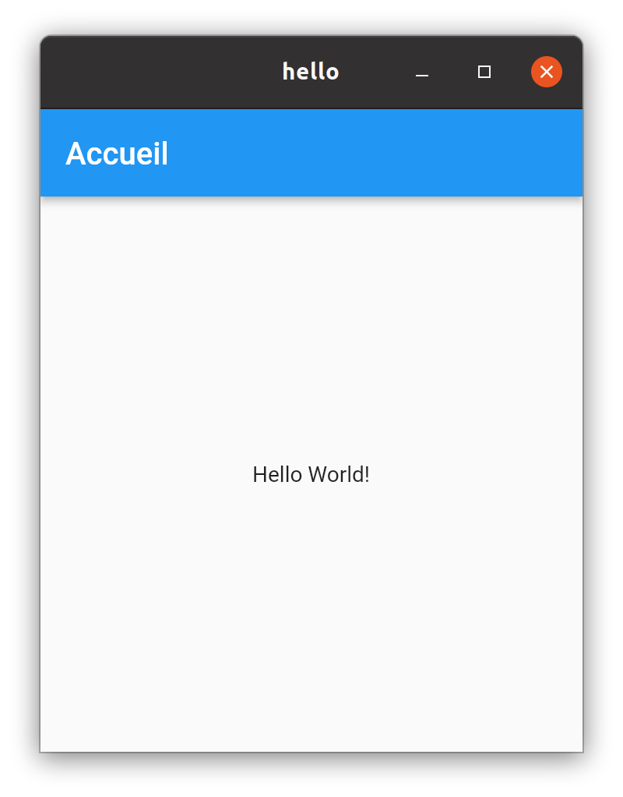
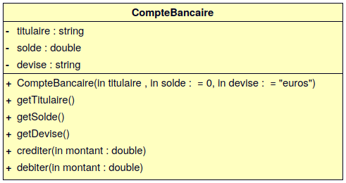
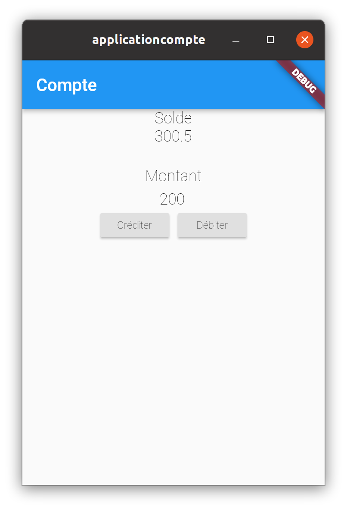

  

[](../../actions)

# TP POO : Flutter

- [TP POO : Flutter](#tp-poo--flutter)
  - [Flutter](#flutter)
  - [Travail demandé](#travail-demandé)
  - [Tests unitaires](#tests-unitaires)
  - [Bac à sable et développement en ligne](#bac-à-sable-et-développement-en-ligne)


Les objectifs de ce TP sont de s’initier à la programmation Flutter en transférant ses connaissances de la programmation orientée objet.

> Pour les enseignants, ceci est un "petit" devoir pour [Github Classroom](https://btssn-lasalle84.github.io/guides-developpement-logiciel/guide-classroom.html). Il montre l'utilisation des tests unitaires en Flutter/Dart, la notation automatique et l'insertion d'un badge pour l'affichage de la note.

## Flutter

**Flutter** est un SDK (_Software Development Kit_) d'application (à l'origine mobile) multiplateforme (_cross-platform_) développé par Google.

> A l'origine, Google a introduit **Flutter** pour le développement d'applications mobiles natives sur Android et iOS.

C'est un _framework_ qui permet de construire et de déployer des applications écrites en langage **Dart**.

> **Dart** est un langage de programmation optimisé pour les applications sur plusieurs plateformes. Il est développé par Google et est utilisé pour créer des applications mobiles, de bureau, de serveur et web.

Flutter supporte les plateformes suivantes :

- Android : API 19 et suivantes
- iOS : iOS 9 et suivantes
- Linux : Debian 10 et suivantes
- macOS : El Capitan et suivantes
- Windows : Windows 7 et suivantes
- Web : Chrome 84 et suivantes, Firefox 72.0 et suivantes, Safari et Edge 1.2.0 et suivantes

Documentation : https://docs.flutter.dev/

Installation : https://docs.flutter.dev/get-started/install/

Exemple sous GNU/Linux Ubuntu 20.04 :

```sh
$ sudo snap install flutter --classic

$ flutter sdk-path
/home/tv/snap/flutter/common/flutter

$ flutter doctor
Doctor summary (to see all details, run flutter doctor -v):
[✓] Flutter (Channel stable, 2.10.0, on Ubuntu 20.04.3 LTS 5.4.0-96-generic, locale fr_FR.UTF-8)
[✓] Android toolchain - develop for Android devices (Android SDK version 30.0.3)
[✓] Chrome - develop for the web
[✓] Android Studio (version 3.6)
[✓] Android Studio (version 2021.1)
[✓] VS Code (version 1.64.0)
[✓] Connected device (1 available)
[✓] HTTP Host Availability

• No issues found!

$ which flutter dart
/snap/bin/flutter
/usr/bin/dart
```

> Android Studio était préalablement installé.

Sur le canal stable de Flutter, les plateformes macOS et Linux sont désactivées par défaut. Il est possible de les activer, pour Linux par exemple : `$ flutter config --enable-linux-desktop`

Passage sur le canal `dev` :

```sh
$ flutter channel dev
$ flutter upgrade
$ flutter config --enable-linux-desktop
$ flutter doctor
Downloading Material fonts...                                      301ms
Downloading package sky_engine...                                  187ms
Downloading flutter_patched_sdk tools...                           329ms
Downloading flutter_patched_sdk_product tools...                   247ms
Downloading linux-x64 tools...                                   1 184ms
Downloading linux-x64/font-subset tools...                         157ms
Doctor summary (to see all details, run flutter doctor -v):
[✓] Flutter (Channel dev, 2.11.0-0.1.pre, on Ubuntu 20.04.4 LTS 5.4.0-100-generic, locale fr_FR.UTF-8)
[✓] Android toolchain - develop for Android devices (Android SDK version 30.0.3)
[✓] Chrome - develop for the web
[✓] Linux toolchain - develop for Linux desktop
[✓] Android Studio (version 3.6)
[✓] Android Studio (version 2021.1)
[✓] VS Code (version 1.64.2)
[✓] Connected device (3 available)
[✓] HTTP Host Availability

• No issues found!

$ flutter --version
Flutter 2.11.0-0.1.pre • channel dev • https://github.com/flutter/flutter.git
Framework • revision b101bfe32f (il y a 6 semaines) • 2022-02-16 07:36:54 -0800
Engine • revision e355993572
Tools • Dart 2.17.0 (build 2.17.0-69.2.beta) • DevTools 2.10.0-dev.1
```

> :eyes: Il faudrait mettre à jour la version de Flutter !

Au final, on obtient les plateformes suivantes sur un poste GNU/Linux Ubuntu 20.04 :

```sh
$ flutter devices
3 connected devices:

SM T813 (mobile) • d95f698401ba0ee8 • android-arm64  • Android 7.0 (API 24)
Linux (desktop)  • linux            • linux-x64      • Ubuntu 20.04.4 LTS 5.4.0-100-generic
Chrome (web)     • chrome           • web-javascript • Google Chrome 98.0.4758.102
```

On pourra lancer l'application sur la plateforme de son choix avec `flutter run` et l'option `-d`, par exemple :

```sh
$ flutter run -d linux
$ flutter run -d chrome
```

> Si erreur de type _null_ : `Error: Cannot run with sound null safety, because the following dependencies` alors : `$ flutter run --no-sound-null-safety`

Pour ajouter des plateformes à un projet existant, il faut faire par exemple dans le dossier du projet : `flutter create --platforms=windows,macos,linux .`

> DevTools : https://docs.flutter.dev/development/tools/devtools/overview

Une application Flutter est organisée en plusieurs répertoires :

- `.dart_tool` : contient notamment les paquets nécessaire à l'application (anciennement le fichier `.packages`)
- `.idea` : Dossier de projet Intellij (supprimable)
- `android` : Dossier du projet Android (Gradle utilisé en tant que gestionnaire de dépendances)
- `build` : Dossier contenenat les différentes versions fabriquées de l'application
- `ios` : Dossier du projet pour iOS (Cocoapods utilisé en tant que gestionnaire de dépendances)
- `lib` : Le code de l'application (`.dart`)
- `linux` : Dossier du projet Linux/Desktop (CMake utilisé en tant que gestionnaire de dépendances), idem pour `windows`et `macos`
- `web` : Dossier du projet web
- `test` : Le code des tests unitaires

Le fichier `pubspec.yaml` contient les informations de base de l’application (nom, description, version, ...), les ressources (`assets`) comme les images, le SDK et les dépendances vers les packages.

```sh
$ cd hello
$ cat pubspec.yaml
name: hello
description: A new Flutter project.

publish_to: 'none' # Remove this line if you wish to publish to pub.dev

version: 1.0.0+1

environment:
  sdk: ">=2.16.1 <3.0.0"

dependencies:
  flutter:
    sdk: flutter

  cupertino_icons: ^1.0.2

dev_dependencies:
  flutter_test:
    sdk: flutter

  flutter_lints: ^1.0.0

flutter:
  uses-material-design: true

$ flutter clean
$ flutter run -d linux
```



## Travail demandé

On souhaite disposer du concept de `Compte`.

Un `Compte` doit posséder un titulaire, un solde et une devise (EUR, USD, ...). Il est possible d’obtenir le nom du titulaire ainsi que le solde et la devise de ce solde. Lorsque l’on crée un compte, il est possible de préciser le nom du titulaire, le solde initial et la devise ou simplement le nom du titulaire et il aura un solde nul et une devise EUR par défaut.

On pourra :

- `crediter()` d'un `montant` passé en argument le solde du `Compte`
- `debiter()` d'un `montant` passé en argument le solde du `Compte`



Fournir la classe `Compte` dans `app/src/main/java/com/lasalle/applicationcompte/CompteBancaire.java`.

Réaliser une application Flutter exploitant le concept de `Compte` :



> Il est possible d'utiliser https://flutterstudio.app/ pour établir le squelette de la GUI.

```sh
$ flutter create applicationcompte --platforms=linux
Creating project applicationcompte...
Running "flutter pub get" in applicationcompte...                1 678ms
Wrote 101 files.

All done!
In order to run your application, type:

  $ cd applicationcompte
  $ flutter run

Your application code is in applicationcompte/lib/main.dart.
```

Pour la plateforme linux, faire : `$ flutter run -d linux`

## Tests unitaires

Lancement des tests :

- la classe `Compte` :

```sh
$ flutter test test/TestCompte.dart
00:02 +3: All tests passed!
```

- la GUI :

```sh
$ flutter test test/TestWidgets.dart
00:02 +1: All tests passed!
```

> Lien : https://docs.flutter.dev/testing

## Bac à sable et développement en ligne

Il est souvent nécessaire de passer par un "bac à sable".

> En informatique, le bac à sable (sandbox) est une zone d'essai permettant d'exécuter des programmes en phase de test ou dans lesquels la confiance est incertaine. C'est notamment très utilisé en sécurité informatique pour sa notion d'isolation.

Il existe de nombreux sites web qui fournissent des EDI (Environnement de Développement Intégré) en ligne pour tester du code ou des services : un espace d'apprentissage séparé. Ils permettent aussi d'échanger des exemples.

Quelques sites :

- DartPad : https://dartpad.dev/
- Flutter : https://zapp.run/
- Coding Ground For Developers : https://www.tutorialspoint.com/codingground.htm pour tout !
  - Dart : https://www.tutorialspoint.com/execute_dart_online.php
- Visual Studio Code Online : https://vscode.dev/
- Codeanywhere (Cloud IDE) : https://codeanywhere.com/

Voir aussi : https://flutterstudio.app/, https://flutlab.io/, ...

---
Thierry Vaira : **[thierry(dot)vaira(at)gmail(dot)com](mailto:thierry.vaira@gmail.com)**
